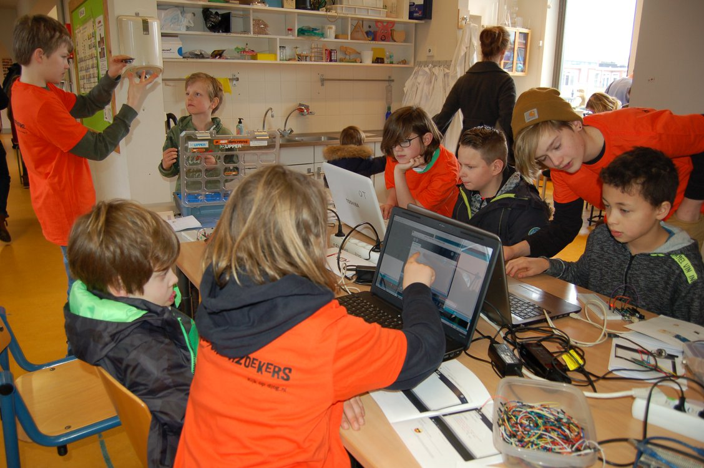

# Arduinokurs för ungdomar


> If you are from Ukraine, you are welcome! See [FAQ](faq.md)
>
> Якщо ви з України, ласкаво просимо. [Перегляньте поширені запитання](faq.md)

En Arduino är en populärt och billigt elktronikgrej
för att bygga maskiner med: den är lätt att kopplas
elkomponenter på och lätt att programmerar.

Under den kurs här ska vi lära oss Arduino, som är båda 
den basis elkringer och den basis programmering.
Den LED ska bli din första elektronikst vän :-)

Först arbetar du dig igenom våra häften för att lära dig grunderna.
Efter ditt första diplom får du joina ett uppfinnarslag.
Och efter det, kanske du kommer att leda ditt eget lag!

Inga förkunskaper krävs.

Det viktigaste i kursen är att lära sig elektronik och programmera tillsammans.

Se "Schema" nedan för mer information.

## Dagschema

 * Dagschema try-out kurs skiljer dig med 'riktigt' kursen:
   * Try-out: 11:e Juni-13:e August
   * Riktigt: 20:e August-Mai

### Dagschemat try-out kursen

 * Första try-out kursdagen: 11:e Juni 2022 (men du är alltid välkommen!) 12:30-14:30
 * Ålder: 8-88 år [*](faq.md)

När  |Vad
-----|---------
12:30|Dörren öppen
12:45|Start
13:30|Rast
14:45|Fortsättning
14:30|Slut

 * Plats: Uppsala Makerspace i Uppsala, [https://www.uppsalamakerspace.se/](https://www.uppsalamakerspace.se/),
   Ekeby Bruk 6M, 752 63 Uppsala
 * Kostnad per elev:
   * 0 kr för Uppsala Makerspace medlemmar, 200 kr för andra
 * Ålder: 8-88 år [*](faq.md)
 * Krav: en bärbar dator med WiFi [*](faq.md)

Din första lektion kan vara vilken dag som helst.
Även utan förvarning.
Om du vet när du kommer är det trevligt om du berättar det för Richel: richel@richelbilderbeek.nl

Har du en annan fråga? Se [vanliga frågor](faq.md).

### Dagschemat 'riktigt' kursen

 * Första kursdagen: 20:e August 2022 (men du är alltid välkommen!) antagligen 10:00-12:30
 * Dag: Varje lördag, utom på röda dagar, sommarlov och jullov
 * Ålder: 8-88 år [*](faq.md)

När  |Vad
-----|---------
10:00|Dörren öppen
10:15|Start
11:00|Rast
11:15|Fortsättning
12:00|Slut

 * Plats: Uppsala Makerspace i Uppsala, [https://www.uppsalamakerspace.se/](https://www.uppsalamakerspace.se/),
   Ekeby Bruk 6M, 752 63 Uppsala
 * Kostnad per elev:
   * September till december: 400 kr för Uppsala Makerspace medlemmar, 600 kr för andra
   * Januari till maj: 400 kr för Uppsala Makerspace medlemmar, 600 kr för andra
 * Ålder: 8-18 år [*](faq.md)
 * Krav: en bärbar dator med WiFi [*](faq.md)

Din första lektion kan vara vilken dag som helst.
Även utan förvarning.
Om du vet när du kommer är det trevligt om du berättar det för Richel: richel@richelbilderbeek.nl

Har du en annan fråga? Se [vanliga frågor](faq.md).

## Betala

### Betala try-out kurs

Kursen kostar ingenting för Uppsala Makerspace medlemmar
och 200 kr för andra per halv år (tips: medlemskap är 200 kr per år!).

Du kan betala in via antingen bankgiro (584-8056) eller Swish (123 056 57 47).
Snälla, använd formatet här (`AC` betyder 'Arduino Course'):

```
AC: [nam], [email]
```

till exempel:

```
AC: Sven Svensson, sven@svensson.se
```

### Betala 'riktigt' kurs

Kursen kostar 400 kr för Uppsala Makerspace medlemmar
och 600 kr för andra per halv år (tips: medlemskap är 200 kr per år!).

Du kan betala in via antingen bankgiro (584-8056) eller Swish (123 056 57 47).
Snälla, använd formatet här (`AC` betyder 'Arduino Course'):

```
AC: [nam], [email]
```

till exempel:

```
AC: Sven Svensson, sven@svensson.se
```

## Årschema

Den här schemat är en generellt ide. Ser veckoschema för detaljerna.

När      |Vad
---------|----------------------------
Juni     |Början try-out kurs, från 11:e Juni
Augusti  |Kursen 1:e semester, från 20:e August
December |Presentation och utvärdering
Januari  |Kursen 2:e semester
Juli     |Presentation och utvärdering 

## Veckoschema

Vecka| Dag      |Vad
-----|----------|-------------------------------------
23   |2022-06-11|1. Början try-out kurs
24   |2022-06-18|2. 
25   |2022-06-25|3. 
26   |2022-07-02|4. 
27   |2022-07-09|5. 
28   |2022-07-16|6. 
.    |2022-07-22|[Pi Annäherings Dag](https://github.com/richelbilderbeek/pi_approximation_day)
29   |2022-07-23|7. 
30   |2022-07-30|8. 
31   |2022-08-06|9. ?Slutpresentation och utvärdering
32   |2022-08-13|Ej kurs, vi är på Kulturnatten istället
33   |2022-08-20|1. Början riktigt kurs
34   |2022-08-27|2. ...

## Impressum

### Äldre bilder

Bilderna är från Richels sista kurs på [De Jonge Onderzoekers Groningen](https://www.djog.nl/):

På en öppen dag undervisar våra elever (i oranga T-shirts) våra gäster:




På slutet av en termin hade vi en presentation:


> Alla bilder är användet med vänligt tillstånd av 'De Jonge Onderzoekers Groningen'

## Länkar

 * [Uppsala Makerspace hemsida](https://www.uppsalamakerspace.se/)
 * [Kursbok: 'Arduino för ungdomar'](https://github.com/richelbilderbeek/arduino_foer_ungdomar)
 * ['Programmeringskurs för ungdomar' hemsida](https://github.com/richelbilderbeek/programmeringskurs_foer_ungdomar)
 * ['git for youngsters' hemsida](https://codeberg.org/richelbilderbeek/git_for_youngsters)

