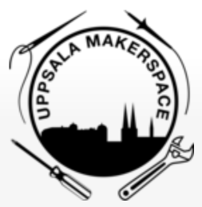
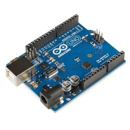

# Arduinokurs



> If you are from Ukraine, you are welcome! See [FAQ](faq.md)
>
> Якщо ви з України, ласкаво просимо. [Перегляньте поширені запитання](faq.md)

En Arduino är en populärt och billigt elktronikgrej
för att bygga maskiner med: den är lätt att kopplas
elkomponenter på och lätt att programmerar.

Under den kurs här ska vi lära oss Arduino, som är båda 
den basis elkringer och den basis programmering.
Den LED ska bli din första elektronikst vän :-)

Först arbetar du dig igenom våra häften för att lära dig grunderna.
Efter ditt första diplom får du joina ett uppfinnarslag.
Och efter det, kanske du kommer att leda ditt eget lag!

Inga förkunskaper krävs. Häfterna har skrivits för tonåringer att läsa.

Det viktigaste i kursen är att lära sig elektronik och programmera tillsammans.

Se "Schema" nedan för mer information.

 * Tycker du mer om att skapa datorspel, 
   kanske [programmeringskursen](https://github.com/richelbilderbeek/programmeringskurs)
   passar dig bättre
 * Tycker du mer om att skapa datorspel med bara vuxna
   kanske [programmeringslag 'tresinformal'](https://github.com/tresinformal/game)
   passar dig bättre

### Dagschema

 * Första kursdagen: 20:e Augusti 2022 (men du är alltid välkommen!) 10:00-12:00
 * Ålder: 8-88 år [*](faq.md)

När  |Vad
-----|-------------------------------------------------------
10:00|Dörr öppnas
10:15|Början
11:00|Rast
11:15|Fortsättning
12:00|Slut/rast
12:15|Möjlig fortsättning för elever med ett diplom och vuxen
13:00|Slut

 * Plats: Uppsala Makerspace i Uppsala, [https://www.uppsalamakerspace.se/](https://www.uppsalamakerspace.se/),
   Ekeby Bruk 6M, 752 63 Uppsala
 * Kostnad per elev:
   * September till december: 400 kr för Uppsala Makerspace medlemmar, 600 kr för andra
   * Januari till maj: 400 kr för Uppsala Makerspace medlemmar, 600 kr för andra
 * Ålder: 8-88 år [*](faq.md)
 * Krav: en bärbar dator med WiFi [*](faq.md)

Din första lektion kan vara vilken dag som helst.
Även utan förvarning.
Om du vet när du kommer är det trevligt om du berättar det för Richel: richel@richelbilderbeek.nl

Har du en annan fråga? Se [vanliga frågor](faq.md).

## Betalning

Kursen kostar 400 kr för Uppsala Makerspace medlemmar
och 600 kr för andra per halv år (tips: medlemskap är 200 kr per år!).

Du kan betala in via antingen bankgiro (584-8056) eller Swish (123 056 57 47).
Snälla, använd formatet här (`AC` betyder 'Arduino Course'):

```
AC: [nam], [email]
```

till exempel:

```
AC: Sven Svensson, sven@svensson.se
```

## Årschema

Detta är det övergripande schemat. Ser veckoschema för detaljerna.

När      |Vad
---------|----------------------------
Januari  |Kursen 1:e semester
Juli     |Presentation och utvärdering 
Augusti  |Sommarlov
September|Kursen 2:e semester
December |Presentation och utvärdering

## Veckoschema

Vecka| Dag      |Vad
-----|----------|-------------------------------------
33   |2022-08-20|1. Programmeringskursen förtsätter igen
34   |2022-08-27|2. Skapa T-shirt med/för 3 elever
35   |2022-09-03|3. Skapa T-shirt med/för sista elever
36   |2022-09-10|4. [Kulturnatten](https://github.com/richelbilderbeek/programmeringskurs/blob/master/activities/20220910_kulturnatten.md): vi undervisar!
37   |2022-09-17|5.
38   |2022-09-24|6.
39   |2022-10-01|7.
40   |2022-10-08|8.
41   |2022-10-15|9.
42   |2022-10-22|10.
43   |2022-10-29|Höstlov
44   |2022-11-05|Höstlov
45   |2022-11-12|11.
46   |2022-11-19|12. [Efterfarsdag](https://github.com/richelbilderbeek/programmeringskurs/blob/master/activities/20221119_efterfarsdag.md) (också farfar, morfar, osv)
47   |2022-11-26|13.
48   |2022-12-03|14. 
49   |2022-12-10|15. [Slutpresentation och utvärdering](https://github.com/richelbilderbeek/programmeringskurs/blob/master/activities/20221210_slutpresentation.md) (varje en är välkomna)
50   |2022-12-17|16. Sista dag
51   |2022-12-24|Jullov
52   |2022-12-31|Jullov
52   |2022-12-30|Jullov
 1   |2023-01-07|1. Kurs försätter igen

## Impressum

[Programmeringskurs](https://github.com/richelbilderbeek/programmeringskurs#impressum)
har fina bilder.

## Länkar

 * [Uppsala Makerspace hemsida](https://www.uppsalamakerspace.se/)
 * [Kursbok: 'Arduino för ungdomar'](https://github.com/richelbilderbeek/arduino_foer_ungdomar)
 * ['Programmeringskurs' hemsida](https://github.com/richelbilderbeek/programmeringskurs)
 * ['git for youngsters' hemsida](https://codeberg.org/richelbilderbeek/git_for_youngsters)

